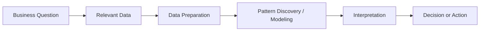
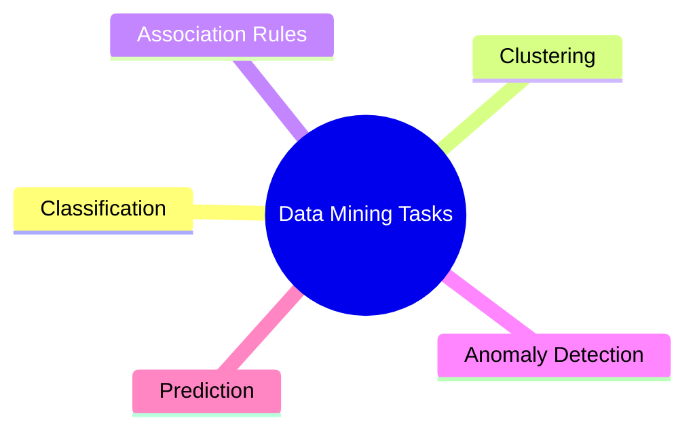
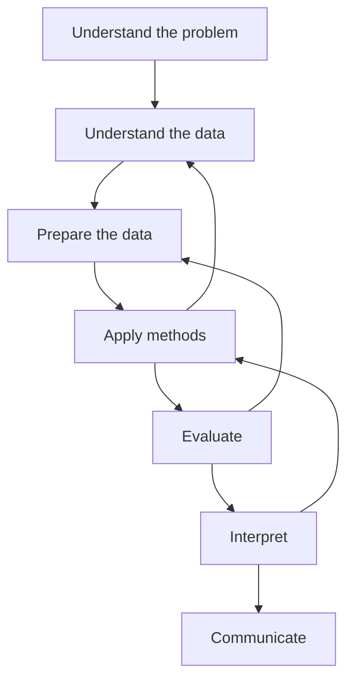
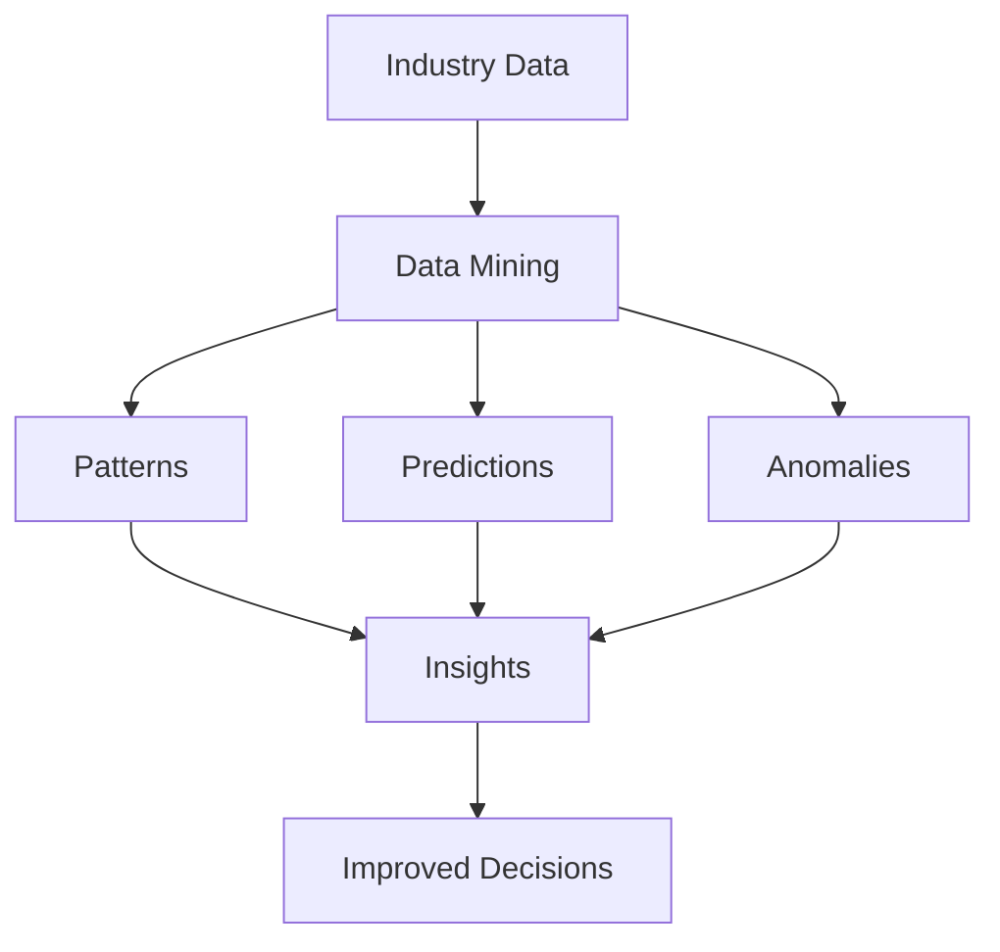
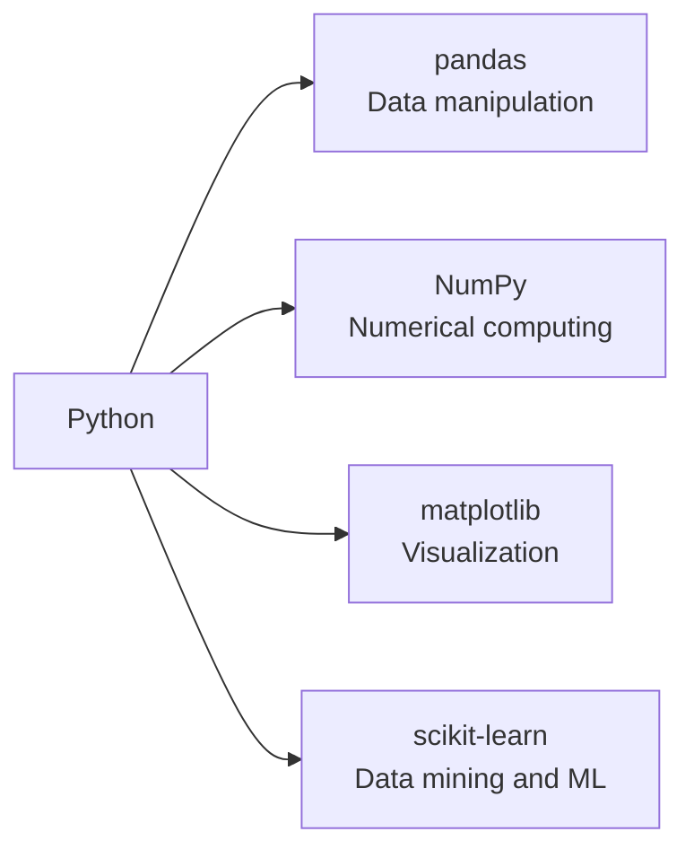
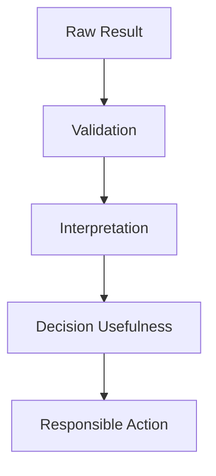
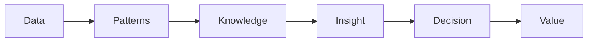

<a id="top"></a>

# Introduction to Data Mining

## Table of Contents

| # | Section |
|---|---------|
| 1 | [Course Overview and the Role of Data Mining](#section-1) |
| 2 | [What Is Data Mining?](#section-2) |
| 2a | &nbsp;&nbsp;&nbsp;↳ [Definitions](#section-2) |
| 2b | &nbsp;&nbsp;&nbsp;↳ [Data Mining vs Related Concepts](#section-2) |
| 3 | [Why Data Mining Matters](#section-3) |
| 4 | [Main Types of Data Mining Tasks](#section-4) |
| 5 | [The Data Mining Process at a Glance](#section-5) |
| 6 | [Applications of Data Mining in Real-World Sectors](#section-6) |
| 7 | [Tools, Technologies, and Typical Work Environments](#section-7) |
| 8 | [Challenges, Limits, and Good Practices](#section-8) |
| 9 | [Key Ideas to Remember](#section-9) |

---

<a id="section-1"></a>

<details>
<summary><strong>1 — Course Overview and the Role of Data Mining</strong></summary>

<br/>

This course introduces the **foundations, process, and practical value of data mining**. Its purpose is to provide a clear understanding of what data mining is, why organizations use it, what kinds of problems it can solve, and how a data mining project is generally carried out from beginning to end.

Data mining is not only about algorithms. It is also about asking the right questions, selecting appropriate data, preparing that data carefully, identifying useful patterns, and transforming those patterns into actionable insights.

---

### Course Objectives

By the end of this course, you will be able to:

- Define data mining clearly and distinguish it from related concepts
- Understand the main goals of a data mining project
- Identify the major categories of data mining tasks
- Recognize the main stages of a data mining workflow
- Explain how data mining is used across different industries
- Understand the tools, limitations, and good practices associated with data mining

---

### The Role of Data Mining in Modern Organizations

In many organizations, large amounts of data are generated every day through transactions, websites, sensors, applications, customer interactions, and internal systems. Data mining helps transform these raw data into **patterns, trends, predictions, and decisions**.

| Organizational Need | Contribution of Data Mining |
|---------------------|-----------------------------|
| **Understanding customers** | Identifies habits, preferences, and behavioral patterns |
| **Improving decisions** | Supports evidence-based strategic and operational decisions |
| **Detecting anomalies** | Reveals fraud, unusual transactions, or system issues |
| **Predicting outcomes** | Estimates future events such as churn, demand, or risk |
| **Segmenting populations** | Groups customers, products, or behaviors into meaningful categories |
| **Optimizing operations** | Improves processes, inventory, workflows, and resource use |

```mermaid
flowchart LR
    A["Raw Data"] --> B["Data Mining Process"]
    B --> C["Patterns and Knowledge"]
    C --> D["Insights"]
    D --> E["Better Decisions"]
    E --> F["Business Value"]
````

---

### What This Course Focuses On

This course focuses on the practical logic of data mining:

* understanding the problem,
* understanding the data,
* preparing the data,
* choosing appropriate techniques,
* analyzing results,
* and communicating findings clearly.

The objective is not only to learn definitions, but also to understand **how to think like someone conducting a real data mining project**.

</details>

<p align="right"><a href="#top">↑ Back to top</a></p>

---

<a id="section-2"></a>

<details>
<summary><strong>2 — What Is Data Mining?</strong></summary>

<br/>

### Definitions

**Data mining** is the process of discovering useful, previously unknown, and meaningful patterns in large datasets.

It combines ideas from several areas, including:

* statistics,
* databases,
* machine learning,
* pattern recognition,
* and data analysis.

Several definitions are commonly used:

| Source / Perspective      | Definition                                                                                                          |
| ------------------------- | ------------------------------------------------------------------------------------------------------------------- |
| **General definition**    | Data mining is the process of extracting useful knowledge from large volumes of data.                               |
| **Business perspective**  | Data mining helps organizations discover patterns that support decision-making.                                     |
| **Technical perspective** | Data mining applies computational and analytical methods to identify structures, relationships, and trends in data. |
| **Practical perspective** | Data mining turns raw data into patterns, rules, predictions, and insights that can be used in the real world.      |

---

### A Simple Way to Understand Data Mining

A useful way to understand data mining is the following:

> Data mining is not just looking at data.
> It is the process of finding **what matters**, **what repeats**, **what differs**, and **what may happen next**.

For example, a store may use data mining to discover that:

* customers who buy one product often buy another one,
* some customers are likely to stop using a service,
* unusual transactions may indicate fraud,
* certain groups of users behave differently from others.

---

### Data Mining vs Related Concepts

Data mining is often confused with several related terms. They are connected, but they are not identical.

| Concept                   | Meaning                                             | Difference from Data Mining                              |
| ------------------------- | --------------------------------------------------- | -------------------------------------------------------- |
| **Data**                  | Raw facts, records, values                          | Data are the starting point                              |
| **Data Analysis**         | Examining data to understand them                   | Broader and often descriptive                            |
| **Statistics**            | Mathematical study of data                          | More focused on inference, probability, and modeling     |
| **Machine Learning**      | Building systems that learn from data               | Often used inside data mining projects                   |
| **Business Intelligence** | Reporting and dashboarding for decision support     | Often more descriptive and reporting-oriented            |
| **Data Mining**           | Discovering useful patterns and knowledge from data | More focused on pattern discovery and insight extraction |

---

### Data Mining vs Machine Learning

These two fields overlap strongly, but they are not exactly the same.

| Data Mining                                                            | Machine Learning                                               |
| ---------------------------------------------------------------------- | -------------------------------------------------------------- |
| Focuses on discovering knowledge in data                               | Focuses on building systems that learn from data               |
| Often includes business understanding and interpretation               | Often emphasizes predictive model performance                  |
| Can include descriptive tasks such as clustering and association rules | Often emphasizes prediction, classification, and optimization  |
| May use machine learning algorithms as tools                           | Machine learning is one of the main engines inside data mining |

```mermaid
flowchart TD
    A["Data Science"] --> B["Data Analysis"]
    A --> C["Statistics"]
    A --> D["Machine Learning"]
    A --> E["Data Mining"]

    E --> F["Pattern Discovery"]
    E --> G["Knowledge Extraction"]
    E --> H["Prediction"]
```

</details>

<p align="right"><a href="#top">↑ Back to top</a></p>

---

<a id="section-3"></a>

<details>
<summary><strong>3 — Why Data Mining Matters</strong></summary>

<br/>

Data mining matters because modern organizations produce more data than humans can manually inspect. Without structured methods, these data remain underused.

Data mining helps answer questions such as:

* Which customers are most likely to leave?
* Which products are often purchased together?
* Which transactions are suspicious?
* Which groups of users behave similarly?
* Which variables seem most strongly linked to a target outcome?

---

### Business Value of Data Mining

| Goal                        | Example                                       |
| --------------------------- | --------------------------------------------- |
| **Increase revenue**        | Product recommendation and customer targeting |
| **Reduce risk**             | Fraud detection and credit risk analysis      |
| **Improve efficiency**      | Process optimization and demand forecasting   |
| **Support strategy**        | Market segmentation and trend analysis        |
| **Improve user experience** | Personalization and behavior analysis         |

---

### Why Data Mining Is More Than a Technical Exercise

A technically strong model is not always useful. A data mining result becomes valuable only when it is:

* based on relevant data,
* aligned with a real objective,
* interpretable,
* reliable,
* and useful for decision-making.

This is why data mining is both a **technical process** and a **problem-solving process**.



</details>

<p align="right"><a href="#top">↑ Back to top</a></p>

---

<a id="section-4"></a>

<details>
<summary><strong>4 — Main Types of Data Mining Tasks</strong></summary>

<br/>

Data mining includes several major types of tasks. Each one answers a different type of question.

---

### Classification

Classification assigns records to predefined categories.

**Question answered:**
To which class does this item belong?

**Examples:**

* spam vs non-spam email,
* fraudulent vs legitimate transaction,
* customer likely to churn vs not likely to churn.

---

### Clustering

Clustering groups similar records together **without predefined labels**.

**Question answered:**
Which observations naturally belong together?

**Examples:**

* customer segmentation,
* grouping products by behavior,
* identifying user profiles.

---

### Association Rule Mining

Association rules find relationships between items that frequently appear together.

**Question answered:**
Which events or items tend to occur together?

**Examples:**

* market basket analysis,
* product recommendation,
* usage pattern discovery.

---

### Anomaly Detection

Anomaly detection identifies observations that differ strongly from the majority.

**Question answered:**
Which observations are unusual or suspicious?

**Examples:**

* fraud detection,
* network intrusion detection,
* unusual sensor readings.

---

### Prediction and Regression

Prediction estimates future or unknown numerical values.

**Question answered:**
What value is likely to occur?

**Examples:**

* sales forecasting,
* predicting product demand,
* estimating delivery time.

---

### Summary Table

| Task Type                   | Objective                   | Example                  |
| --------------------------- | --------------------------- | ------------------------ |
| **Classification**          | Assign to a known category  | Fraud / non-fraud        |
| **Clustering**              | Group similar items         | Customer segments        |
| **Association Rules**       | Find co-occurrence patterns | Products bought together |
| **Anomaly Detection**       | Detect unusual behavior     | Suspicious activity      |
| **Prediction / Regression** | Estimate a value            | Future sales             |



</details>

<p align="right"><a href="#top">↑ Back to top</a></p>

---

<a id="section-5"></a>

<details>
<summary><strong>5 — The Data Mining Process at a Glance</strong></summary>

<br/>

A data mining project usually follows a structured process. Even though details vary from one context to another, the overall logic remains similar.

---

### High-Level Workflow


---

### Main Stages

| Stage                      | Purpose                                               |
| -------------------------- | ----------------------------------------------------- |
| **Business Understanding** | Clarify the problem, objectives, and success criteria |
| **Data Understanding**     | Explore the data, variables, sources, and quality     |
| **Data Preparation**       | Clean, transform, and organize the data               |
| **Technique Selection**    | Choose the right task and method                      |
| **Modeling / Discovery**   | Apply algorithms or pattern discovery methods         |
| **Evaluation**             | Measure quality, relevance, and usefulness            |
| **Interpretation**         | Explain what the results mean                         |
| **Communication**          | Present findings to decision-makers clearly           |

---

### Why the Process Is Iterative

A data mining project is rarely linear from beginning to end. In practice, teams often move back and forth between stages.

For example:

* after cleaning the data, new issues may appear;
* after modeling, missing variables may become obvious;
* after evaluation, the wrong technique may need to be replaced.



The next file in the course will focus specifically on this lifecycle in a much more detailed way.

</details>

<p align="right"><a href="#top">↑ Back to top</a></p>

---

<a id="section-6"></a>

<details>
<summary><strong>6 — Applications of Data Mining in Real-World Sectors</strong></summary>

<br/>

Data mining is used across many sectors because pattern discovery and predictive insights are useful in almost every domain where data exist.

---

### Examples by Sector

| Sector                 | Use of Data Mining         | Example                         |
| ---------------------- | -------------------------- | ------------------------------- |
| **Retail**             | Customer behavior analysis | Product recommendation          |
| **Finance**            | Risk and fraud detection   | Suspicious transaction analysis |
| **Healthcare**         | Clinical pattern discovery | Disease risk prediction         |
| **Education**          | Learning analytics         | Dropout risk identification     |
| **Telecommunications** | Customer retention         | Churn prediction                |
| **Manufacturing**      | Process optimization       | Predictive maintenance          |
| **Cybersecurity**      | Threat detection           | Network anomaly detection       |
| **Transportation**     | Operational optimization   | Traffic and route analysis      |
| **Marketing**          | Audience segmentation      | Campaign targeting              |
| **E-commerce**         | Personalization            | Purchase pattern analysis       |

---

### Concrete Illustrations

#### Retail

A retail company may analyze purchase history to identify:

* frequent item combinations,
* customer segments,
* and seasonal buying patterns.

#### Banking

A bank may detect:

* abnormal transaction sequences,
* high-risk customer behavior,
* and hidden fraud patterns.

#### Education

An educational institution may use data mining to discover:

* which behaviors are associated with student success,
* which learners are at risk,
* and which courses cause the most difficulty.

#### Healthcare

Hospitals and research centers may mine data to identify:

* patient clusters,
* risk factors,
* and correlations between treatments and outcomes.



</details>

<p align="right"><a href="#top">↑ Back to top</a></p>

---

<a id="section-7"></a>

<details>
<summary><strong>7 — Tools, Technologies, and Typical Work Environments</strong></summary>

<br/>

Data mining is supported by many tools and environments. The right choice depends on the size of the data, the technical context, the project goals, and the users involved.

---

### Common Tools

| Category                  | Examples                                | Purpose                                   |
| ------------------------- | --------------------------------------- | ----------------------------------------- |
| **Spreadsheets**          | Excel, Google Sheets                    | Basic data exploration                    |
| **Programming**           | Python, R                               | Data preparation, modeling, visualization |
| **Libraries**             | pandas, NumPy, scikit-learn, matplotlib | Analysis and machine learning             |
| **Databases**             | MySQL, PostgreSQL, SQL Server           | Data storage and querying                 |
| **Big Data Tools**        | Spark, Hadoop                           | Large-scale data processing               |
| **Visualization**         | Power BI, Tableau                       | Dashboards and communication              |
| **Notebook Environments** | Jupyter, Colab                          | Interactive analysis                      |

---

### Why Python Is Frequently Used

Python is widely used in data mining because it offers:

* clear syntax,
* strong libraries,
* support for preprocessing and modeling,
* and easy integration with notebooks, APIs, and visualization tools.

Typical Python stack for a data mining workflow:



---

### Typical Working Environments

A data mining project may be carried out in:

* a local Python environment,
* a Jupyter notebook,
* a cloud environment,
* a database-connected analytics platform,
* or a collaborative enterprise setting.

The choice depends on:

* data volume,
* number of collaborators,
* infrastructure,
* and security requirements.

</details>

<p align="right"><a href="#top">↑ Back to top</a></p>

---

<a id="section-8"></a>

<details>
<summary><strong>8 — Challenges, Limits, and Good Practices</strong></summary>

<br/>

Data mining is powerful, but it is not magic. Poor data, unclear objectives, and weak interpretation can produce misleading results.

---

### Common Challenges

| Challenge                               | Explanation                                                           |
| --------------------------------------- | --------------------------------------------------------------------- |
| **Poor data quality**                   | Missing values, duplicates, noisy records, inconsistent formats       |
| **Wrong objective**                     | Solving the wrong problem leads to useless results                    |
| **Too much data, too little relevance** | Large volume does not guarantee useful information                    |
| **Bias in the data**                    | Historical bias may be reproduced in results                          |
| **Overfitting**                         | A model performs well on known data but poorly on new data            |
| **Misinterpretation**                   | A pattern may be statistically visible but not practically meaningful |

---

### Good Practices

| Good Practice                           | Why It Matters                                        |
| --------------------------------------- | ----------------------------------------------------- |
| **Start with the problem**              | Technique should serve the objective                  |
| **Understand the data before modeling** | Many problems begin with poor data understanding      |
| **Prepare data carefully**              | Data quality strongly affects result quality          |
| **Choose the right method**             | Not every problem requires the same approach          |
| **Evaluate critically**                 | Good metrics do not automatically mean useful results |
| **Communicate clearly**                 | Results must be understandable and actionable         |

---

### A Critical Reminder

Finding a pattern does not automatically mean finding a truth.

For example:

* a correlation is not always causation,
* a cluster is not always meaningful,
* and a prediction is not always reliable enough for real decisions.

This is why interpretation, domain knowledge, and validation remain essential.



</details>

<p align="right"><a href="#top">↑ Back to top</a></p>

---

<a id="section-9"></a>

<details>
<summary><strong>9 — Key Ideas to Remember</strong></summary>

<br/>

### Essential Takeaways

* Data mining is the process of extracting useful knowledge from data.
* It is not limited to algorithms; it includes problem understanding, data preparation, evaluation, and interpretation.
* Data mining is used in many sectors such as finance, retail, healthcare, education, and cybersecurity.
* The major task families include classification, clustering, association rules, anomaly detection, and prediction.
* Data mining projects follow a structured workflow, but that workflow is iterative.
* Good data mining requires technical rigor, clear objectives, and careful interpretation.

---

### Final Perspective

Data mining is one of the most important ways to turn data into value. It helps move from:

* raw records,
* to patterns,
* to knowledge,
* to better decisions.

It is therefore both a technical discipline and a practical decision-support discipline.



</details>

<p align="right"><a href="#top">↑ Back to top</a></p>

