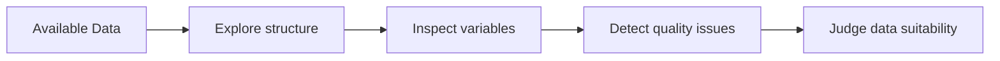
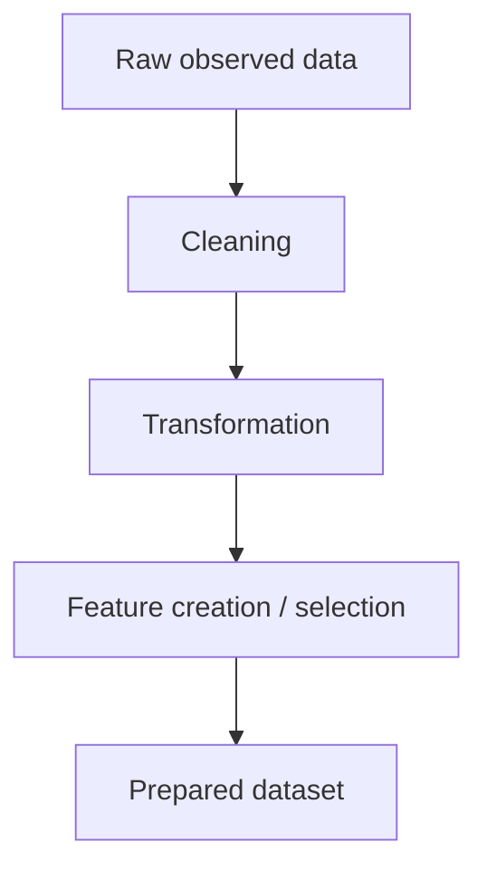
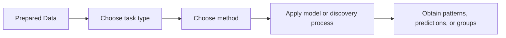
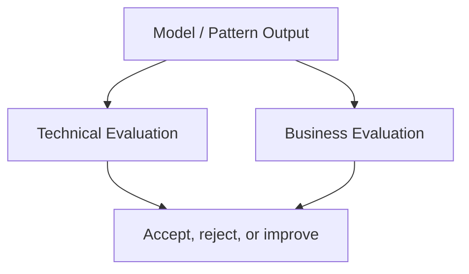
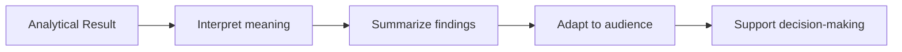
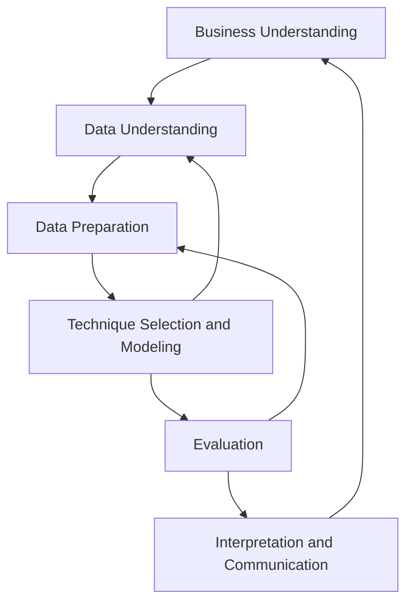
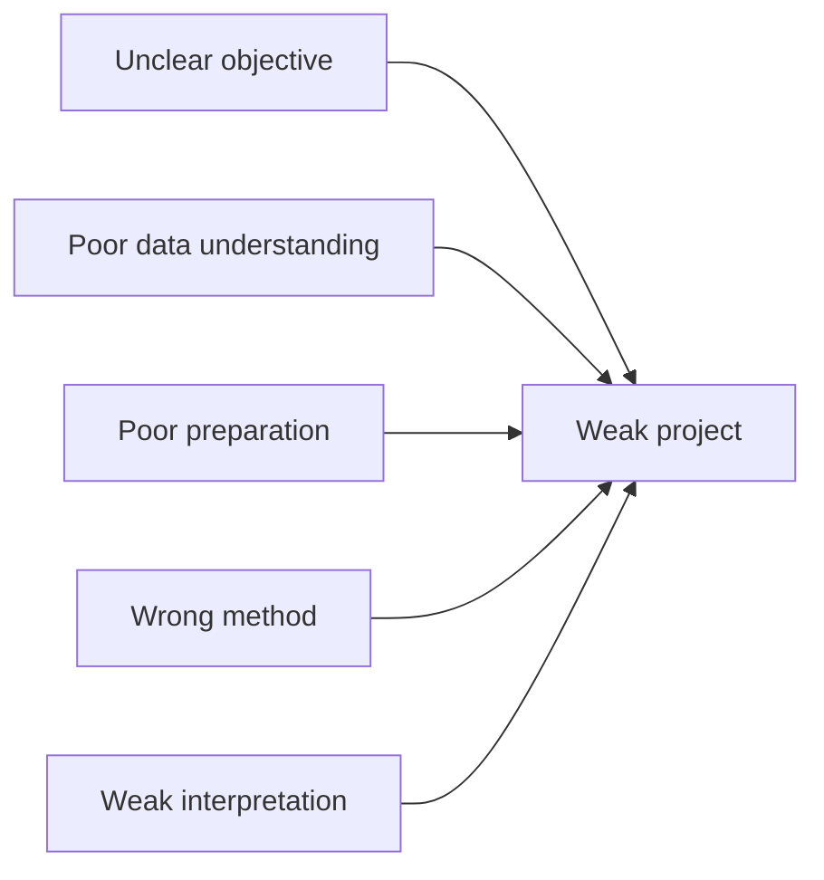
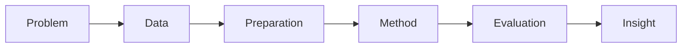

<a id="top"></a>

# Data Mining Lifecycle

## Table of Contents

| # | Section |
|---|---------|
| 1 | [Overview of the Data Mining Lifecycle](#section-1) |
| 2 | [Stage 1 — Business Understanding](#section-2) |
| 2a | &nbsp;&nbsp;&nbsp;↳ [Why This Stage Comes First](#section-2) |
| 2b | &nbsp;&nbsp;&nbsp;↳ [Typical Questions to Clarify](#section-2) |
| 3 | [Stage 2 — Data Understanding](#section-3) |
| 3a | &nbsp;&nbsp;&nbsp;↳ [What to Examine in the Data](#section-3) |
| 3b | &nbsp;&nbsp;&nbsp;↳ [Early Quality Checks](#section-3) |
| 4 | [Stage 3 — Data Preparation](#section-4) |
| 4a | &nbsp;&nbsp;&nbsp;↳ [Cleaning, Transforming, and Structuring](#section-4) |
| 4b | &nbsp;&nbsp;&nbsp;↳ [Why Preparation Takes So Much Time](#section-4) |
| 5 | [Stage 4 — Technique Selection and Modeling](#section-5) |
| 5a | &nbsp;&nbsp;&nbsp;↳ [Choosing the Right Task](#section-5) |
| 5b | &nbsp;&nbsp;&nbsp;↳ [From Method to Model or Pattern](#section-5) |
| 6 | [Stage 5 — Evaluation](#section-6) |
| 6a | &nbsp;&nbsp;&nbsp;↳ [Technical Evaluation](#section-6) |
| 6b | &nbsp;&nbsp;&nbsp;↳ [Business Evaluation](#section-6) |
| 7 | [Stage 6 — Interpretation and Communication](#section-7) |
| 8 | [Why the Lifecycle Is Iterative and Not Linear](#section-8) |
| 9 | [Common Mistakes Across the Lifecycle](#section-9) |
| 10 | [Key Ideas to Remember](#section-10) |

---

<a id="section-1"></a>

<details>
<summary><strong>1 — Overview of the Data Mining Lifecycle</strong></summary>

<br/>

A data mining project follows a structured sequence of stages. This sequence is often called the **data mining lifecycle**. It provides a logical path from the initial problem to the final insight.

The lifecycle is important because data mining is not only about applying an algorithm. A successful project depends on:

- understanding the real problem,
- understanding the available data,
- preparing those data correctly,
- selecting the right method,
- evaluating the results properly,
- and communicating findings clearly.

---

### The Main Lifecycle Stages

```mermaid
flowchart LR
    A["Business Understanding"] --> B["Data Understanding"]
    B --> C["Data Preparation"]
    C --> D["Technique Selection and Modeling"]
    D --> E["Evaluation"]
    E --> F["Interpretation and Communication"]
````

---

### A Simple Reading of the Lifecycle

| Stage                                | Main Purpose                                               |
| ------------------------------------ | ---------------------------------------------------------- |
| **Business Understanding**           | Clarify the real problem and objectives                    |
| **Data Understanding**               | Explore the available data and their quality               |
| **Data Preparation**                 | Clean, transform, and organize the data                    |
| **Technique Selection and Modeling** | Choose and apply suitable methods                          |
| **Evaluation**                       | Verify if the result is technically and practically useful |
| **Interpretation and Communication** | Explain the results and their meaning                      |

---

### Why This Lifecycle Matters

Without a lifecycle, teams often jump too quickly into tools and algorithms. This usually creates poor outcomes because:

* the wrong problem is being solved,
* the wrong data are selected,
* poor-quality data are ignored,
* inappropriate methods are applied,
* or results are misunderstood.

A lifecycle helps maintain structure, rigor, and relevance from beginning to end.

</details>

<p align="right"><a href="#top">↑ Back to top</a></p>

---

<a id="section-2"></a>

<details>
<summary><strong>2 — Stage 1 — Business Understanding</strong></summary>

<br/>

The first stage is **Business Understanding**. Even in academic projects, this stage remains essential. It is the moment when the project team clarifies what problem is being addressed and why it matters.

This stage asks a fundamental question:

> What exactly is the problem, and what kind of result would be useful?

---

### Why This Stage Comes First

Many data mining failures begin here. Teams may start analyzing data before they fully understand:

* what decision needs support,
* what question must be answered,
* what success means,
* and what constraints exist.

If the objective is unclear, even a technically impressive model may be useless.

---

### Typical Questions to Clarify

| Question                             | Why It Matters                                    |
| ------------------------------------ | ------------------------------------------------- |
| **What is the problem?**             | Prevents vague or poorly defined projects         |
| **Why is this problem important?**   | Connects the work to a real need                  |
| **Who will use the result?**         | Helps adapt the result to the audience            |
| **What type of output is expected?** | Prediction, grouping, pattern, explanation, alert |
| **How will success be judged?**      | Defines useful criteria before modeling begins    |
| **What limitations exist?**          | Time, data access, quality, technical constraints |

---

### Example of Good vs Poor Business Understanding

| Weak Definition       | Better Definition                                                    |
| --------------------- | -------------------------------------------------------------------- |
| “Analyze sales data.” | “Identify the main factors associated with low-performing products.” |
| “Study students.”     | “Detect patterns linked to course dropout risk.”                     |
| “Work on customers.”  | “Segment customers into meaningful behavioral groups.”               |

---

### Main Output of This Stage

At the end of this stage, the project should have:

* a clearly defined problem,
* one or more precise objectives,
* an idea of the expected output,
* and a general direction for the rest of the workflow.

```mermaid
flowchart TD
    A["Initial vague idea"] --> B["Clarify the problem"]
    B --> C["Define objectives"]
    C --> D["Identify expected output"]
    D --> E["Project direction"]
```

</details>

<p align="right"><a href="#top">↑ Back to top</a></p>

---

<a id="section-3"></a>

<details>
<summary><strong>3 — Stage 2 — Data Understanding</strong></summary>

<br/>

Once the problem is clear, the next stage is **Data Understanding**. This stage focuses on learning what data are available, what they contain, how they are structured, and whether they are suitable for the objective.

This stage is not yet about fixing the data. It is about **observing, exploring, and diagnosing** them.

---

### What to Examine in the Data

| Aspect to Examine | Examples                                         |
| ----------------- | ------------------------------------------------ |
| **Source**        | CSV file, database, API, logs, spreadsheet       |
| **Variables**     | Names, meanings, units, data types               |
| **Volume**        | Number of rows, columns, files, records          |
| **Quality**       | Missing values, duplicates, inconsistent entries |
| **Distribution**  | Ranges, frequencies, categories, skewness        |
| **Relevance**     | Whether variables are useful for the objective   |

---

### Typical Questions During Data Understanding

* What does each column represent?
* Which variables appear important?
* Are some fields incomplete or inconsistent?
* Are there obvious errors or impossible values?
* Is the dataset large enough?
* Are labels available if classification is needed?
* Do the data match the problem defined earlier?

---

### Early Quality Checks

At this stage, analysts often perform basic checks such as:

* previewing the first rows,
* identifying data types,
* counting missing values,
* checking unique categories,
* visualizing distributions,
* and spotting suspicious records.



---

### Why This Stage Is Essential

Many mistakes happen because teams assume they understand the data when they do not. A variable name may be misleading. A category may contain hidden inconsistencies. A column may have missing values that change the meaning of results.

Data understanding creates the foundation for trustworthy work later.

</details>

<p align="right"><a href="#top">↑ Back to top</a></p>

---

<a id="section-4"></a>

<details>
<summary><strong>4 — Stage 3 — Data Preparation</strong></summary>

<br/>

After understanding the data, the next step is **Data Preparation**. This is the stage where the dataset is made usable for analysis or modeling.

In many projects, this is the longest and most demanding phase.

---

### Cleaning, Transforming, and Structuring

Data preparation may include:

* removing duplicates,
* handling missing values,
* correcting inconsistent formats,
* converting data types,
* normalizing or scaling values,
* encoding categories,
* selecting useful columns,
* merging datasets,
* and creating new variables.

---

### Common Preparation Tasks

| Task                        | Purpose                                             |
| --------------------------- | --------------------------------------------------- |
| **Cleaning**                | Remove errors, duplicates, and inconsistent entries |
| **Handling missing values** | Prevent incomplete records from distorting results  |
| **Transformation**          | Convert data into usable formats                    |
| **Feature engineering**     | Create more informative variables                   |
| **Selection**               | Keep relevant columns and reduce noise              |
| **Integration**             | Combine data from different sources                 |

---

### Why Preparation Takes So Much Time

Data are often messy in the real world. For example:

* dates may use different formats,
* categories may be spelled differently,
* numeric columns may contain text,
* some fields may be empty,
* and some values may be impossible.

Even a strong method will produce weak results if preparation is poor.



---

### A Critical Principle

At this stage, the goal is not to make the data look perfect.
The goal is to make them **consistent, usable, and aligned with the project objective**.

</details>

<p align="right"><a href="#top">↑ Back to top</a></p>

---

<a id="section-5"></a>

<details>
<summary><strong>5 — Stage 4 — Technique Selection and Modeling</strong></summary>

<br/>

Once the data are prepared, the next stage is to choose the right method and apply it. This stage is often described as **Technique Selection and Modeling**.

Here the team decides what type of data mining task fits the objective best.

---

### Choosing the Right Task

The technique depends on the question being asked.

| Objective                          | Likely Task Type            |
| ---------------------------------- | --------------------------- |
| Assign an item to a known category | **Classification**          |
| Group similar items without labels | **Clustering**              |
| Find items that appear together    | **Association Rule Mining** |
| Detect suspicious or unusual cases | **Anomaly Detection**       |
| Estimate a future or unknown value | **Prediction / Regression** |

---

### From Method to Model or Pattern

This stage may involve:

* selecting one or more algorithms,
* training or applying a model,
* generating clusters,
* extracting association rules,
* or identifying anomalies.

The output depends on the method.

| Method Family               | Typical Output             |
| --------------------------- | -------------------------- |
| **Classification**          | Predicted classes          |
| **Clustering**              | Groups or segments         |
| **Association Rules**       | Co-occurrence rules        |
| **Anomaly Detection**       | Suspicious observations    |
| **Regression / Prediction** | Estimated numerical values |

---

### Important Idea

The best method is not necessarily the most complex one.
A simpler approach may be preferable if it is:

* easier to interpret,
* sufficient for the objective,
* and more stable on the available data.



---

### What This Stage Produces

At the end of this stage, the project usually produces one of the following:

* a trained predictive model,
* a set of discovered rules,
* a clustering structure,
* a list of anomalies,
* or another type of analytical output.

</details>

<p align="right"><a href="#top">↑ Back to top</a></p>

---

<a id="section-6"></a>

<details>
<summary><strong>6 — Stage 5 — Evaluation</strong></summary>

<br/>

After applying methods, the result must be evaluated. This stage checks whether the output is good enough, useful enough, and aligned with the initial objective.

Evaluation is not only technical. It is also practical.

---

### Technical Evaluation

Technical evaluation checks the quality of the result using appropriate measures.

Examples:

* accuracy, precision, recall, or F1-score for classification,
* within-cluster similarity for clustering,
* support and confidence for association rules,
* error measures for numerical prediction.

---

### Business Evaluation

A technically acceptable result may still fail in practice.

For example:

* a model may be accurate but impossible to explain,
* a pattern may be statistically visible but not useful,
* a segmentation may exist mathematically but have no practical value.

That is why evaluation should also ask:

* Does this result answer the original question?
* Is it understandable?
* Is it actionable?
* Is it reliable enough to support decisions?

---

### Two Evaluation Perspectives

| Evaluation Type          | Main Concern                      |
| ------------------------ | --------------------------------- |
| **Technical Evaluation** | Is the result analytically sound? |
| **Business Evaluation**  | Is the result useful in context?  |



---

### When Evaluation Leads Backward

Evaluation often reveals problems such as:

* weak data quality,
* missing features,
* wrong method selection,
* or unrealistic objectives.

When that happens, the project may need to return to earlier stages.

This is one reason why the lifecycle is iterative.

</details>

<p align="right"><a href="#top">↑ Back to top</a></p>

---

<a id="section-7"></a>

<details>
<summary><strong>7 — Stage 6 — Interpretation and Communication</strong></summary>

<br/>

The final stage is **Interpretation and Communication**. This is where analytical results are translated into understandable meaning.

A good result is not only something that exists mathematically. It is something that can be explained clearly.

---

### Interpretation

Interpretation means answering questions such as:

* What do these results actually mean?
* Which variables seem most important?
* What pattern has been discovered?
* What practical conclusion can be drawn?
* What should be done next?

---

### Communication

Communication means presenting the findings to the intended audience in a useful way.

Different audiences may need different forms of communication:

| Audience                 | Likely Need                               |
| ------------------------ | ----------------------------------------- |
| **Technical audience**   | Method, metrics, assumptions, limitations |
| **Managerial audience**  | Key findings, impact, recommendations     |
| **Operational audience** | Practical implications and next steps     |

---

### What Good Communication Includes

Good communication usually includes:

* the original objective,
* a summary of the data used,
* the method applied,
* the main findings,
* the limitations,
* and the recommended interpretation.



---

### Why This Stage Matters

If a project reaches a strong result but no one understands it, trusts it, or knows what to do with it, its value remains limited.

Interpretation and communication are therefore not optional final touches. They are part of the real success of the lifecycle.

</details>

<p align="right"><a href="#top">↑ Back to top</a></p>

---

<a id="section-8"></a>

<details>
<summary><strong>8 — Why the Lifecycle Is Iterative and Not Linear</strong></summary>

<br/>

The lifecycle is often drawn as a sequence, but real projects rarely follow a perfect straight line.

In practice, teams move back and forth between stages.

---

### Typical Iterations

| Situation                              | Likely Return                                   |
| -------------------------------------- | ----------------------------------------------- |
| Important values are missing           | Back to data understanding or preparation       |
| Chosen variables are not useful        | Back to data preparation                        |
| Model performance is weak              | Back to feature engineering or method selection |
| Result is not useful for the objective | Back to business understanding                  |
| Interpretation reveals hidden issues   | Back to earlier stages                          |

---

### Lifecycle as a Loop



---

### The Real Meaning of Iteration

Iteration does not mean failure.
It means refinement.

Each return to an earlier stage improves clarity, data quality, method choice, or usefulness. This is a normal part of good analytical work.

</details>

<p align="right"><a href="#top">↑ Back to top</a></p>

---

<a id="section-9"></a>

<details>
<summary><strong>9 — Common Mistakes Across the Lifecycle</strong></summary>

<br/>

Several recurring mistakes weaken data mining projects.

---

### Frequent Mistakes

| Mistake                                     | Why It Is a Problem                               |
| ------------------------------------------- | ------------------------------------------------- |
| **Starting with algorithms too early**      | Ignores the real problem and data quality         |
| **Using unsuitable data**                   | Produces weak or misleading results               |
| **Skipping data understanding**             | Hidden issues remain undetected                   |
| **Underestimating preparation work**        | Poor input leads to poor output                   |
| **Choosing a method because it is popular** | The method may not fit the objective              |
| **Evaluating only technically**             | Useful-looking metrics may hide practical failure |
| **Ignoring interpretation**                 | Results remain disconnected from decisions        |

---

### A Practical Reminder

A weak method applied to well-understood, well-prepared data may be more valuable than an advanced method applied blindly.

The lifecycle protects against impulsive analysis by forcing structure and reflection at each stage.



</details>

<p align="right"><a href="#top">↑ Back to top</a></p>

---

<a id="section-10"></a>

<details>
<summary><strong>10 — Key Ideas to Remember</strong></summary>

<br/>

### Essential Takeaways

* The data mining lifecycle is a structured process that guides projects from problem definition to final insight.
* The major stages are business understanding, data understanding, data preparation, technique selection and modeling, evaluation, and interpretation/communication.
* A strong project depends on more than algorithms. It depends on clarity, data quality, relevance, and interpretation.
* The lifecycle is iterative, not perfectly linear.
* Evaluation must be both technical and practical.
* Communication is part of the success of the project, not only its final presentation.

---

### Final Perspective

The lifecycle helps transform a vague question into a meaningful analytical result.

It creates a disciplined path from:

* problem,
* to data,
* to preparation,
* to method,
* to evaluation,
* to insight.



</details>

<p align="right"><a href="#top">↑ Back to top</a></p>

