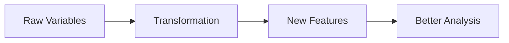
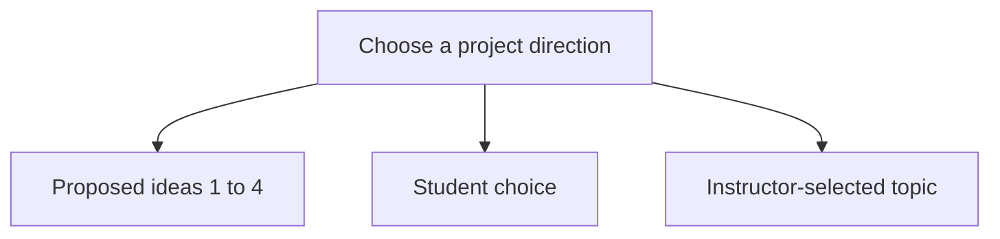
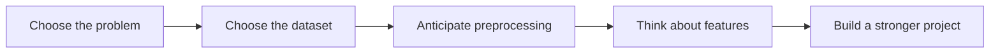

<a id="top"></a>

# Choosing the Business Problem and the Dataset

## Table of Contents

| # | Section |
|---|---------|
| 1 | [Purpose of This Stage](#section-1) |
| 2 | [Step 1 — Choose a Business Problem First](#section-2) |
| 3 | [Step 2 — Choose a Dataset That Matches the Problem](#section-3) |
| 4 | [Step 3 — Think About Preprocessing Early](#section-4) |
| 5 | [Step 4 — Think About Feature Engineering Early](#section-5) |
| 6 | [How to Decide Without Rushing](#section-6) |
| 7 | [Recommended Dataset Sources](#section-7) |
| 8 | [Simple Project Ideas](#section-8) |
| 9 | [Project Choice Options](#section-9) |
| 10 | [Key Ideas to Remember](#section-10) |

---

<a id="section-1"></a>

<details>
<summary><strong>1 — Purpose of This Stage</strong></summary>

<br/>

At the beginning of a data mining project, many students want to jump directly into algorithms. This is usually a mistake.

A strong project does **not** begin with Python code, classification, clustering, or model evaluation. It begins with a clear problem, a relevant dataset, and an early understanding of what kind of preprocessing and feature engineering may be needed.

This stage is designed to help students make good decisions before moving forward.

---

### Main Objective of This Stage

The goal is to make students think carefully about:

- what problem they want to study,
- why that problem is interesting,
- what dataset can support that problem,
- what difficulties may appear in the data,
- and what transformations may be needed before analysis.

---

### What Students Should Understand

Before moving to the next stage, students should be able to answer these questions:

| Question | Why It Matters |
|----------|----------------|
| **What problem am I trying to solve?** | Gives direction to the whole project |
| **Why is this problem meaningful?** | Makes the work more relevant and easier to justify |
| **What dataset can support this problem?** | Prevents random dataset selection |
| **What issues may exist in the data?** | Helps anticipate cleaning and preprocessing |
| **What useful variables might be created later?** | Introduces feature engineering early |

```mermaid
flowchart LR
    A["Business Problem"] --> B["Dataset Choice"]
    B --> C["Data Understanding"]
    C --> D["Preprocessing"]
    D --> E["Feature Engineering"]
    E --> F["Analysis / Modeling"]
````

</details>

<p align="right"><a href="#top">↑ Back to top</a></p>

---

<a id="section-2"></a>

<details>
<summary><strong>2 — Step 1 — Choose a Business Problem First</strong></summary>

<br/>

Students should begin by choosing a **business problem**, or more broadly, a **real-world problem**.

This does not necessarily mean a company problem only. It can also be a social problem, public health problem, education problem, housing problem, tourism problem, or environmental problem.

The key idea is simple:

> Do not choose the dataset first without knowing what question you want to answer.

---

### What Is a Business Problem in This Course?

A business problem is a practical question that data can help explore.

Examples:

* Which customers are likely to cancel a service?
* Which products sell poorly and why?
* Which neighborhoods have the highest Airbnb prices?
* Which countries show the strongest child health improvements?
* Which factors are associated with student success or dropout?

---

### Good Starting Questions

Students should try to define a problem using one of the following forms:

* **What factors are associated with ... ?**
* **Can we identify patterns in ... ?**
* **Can we group ... into meaningful categories?**
* **Can we detect unusual cases in ... ?**
* **Can we predict ... using available variables?**

---

### Examples of Weak vs Strong Problem Definitions

| Weak Problem                     | Stronger Problem                                                                           |
| -------------------------------- | ------------------------------------------------------------------------------------------ |
| “I want to analyze data.”        | “I want to identify factors linked to high Airbnb prices in a city.”                       |
| “I want to work on health data.” | “I want to explore which indicators are associated with child mortality across countries.” |
| “I want a Kaggle dataset.”       | “I want a dataset that helps me study customer churn or segmentation.”                     |

---

### What Students Should Write at This Stage

Each student or team should be able to write:

1. a short title for the problem,
2. a one-paragraph explanation of the problem,
3. and one main question the project will explore.

</details>

<p align="right"><a href="#top">↑ Back to top</a></p>

---

<a id="section-3"></a>

<details>
<summary><strong>3 — Step 2 — Choose a Dataset That Matches the Problem</strong></summary>

<br/>

Once the problem is defined, the next step is to choose a dataset that truly supports it.

Students should not choose a dataset only because:

* it looks popular,
* it is easy to download,
* or it has many rows.

The dataset must be linked to the chosen question.

---

### What to Check Before Selecting a Dataset

| Criterion         | What to Check                                                      |
| ----------------- | ------------------------------------------------------------------ |
| **Relevance**     | Does the dataset help answer the problem?                          |
| **Size**          | Is it large enough to be interesting, but still manageable?        |
| **Variables**     | Are the columns meaningful and usable?                             |
| **Quality**       | Are there too many missing values or errors?                       |
| **Clarity**       | Is the meaning of each field understandable?                       |
| **Accessibility** | Can students download and use it without major technical barriers? |

---

### Practical Advice

A good dataset for this course should usually have:

* clear column names,
* understandable variables,
* enough data to make analysis meaningful,
* and a direct link to the chosen project question.

Students should avoid datasets that are:

* too large for their level,
* too complex to interpret,
* badly documented,
* or unrelated to the project objective.

---

### Before Finalizing the Dataset

Students should ask:

* Does this dataset actually help answer my question?
* Are the variables understandable?
* Do I already see possible preprocessing tasks?
* Can I imagine useful charts, patterns, or models from it?

```mermaid
flowchart TD
    A["Project Question"] --> B["Candidate Dataset"]
    B --> C{Relevant?}
    C -- No --> D["Reject dataset"]
    C -- Yes --> E{Understandable and usable?}
    E -- No --> D
    E -- Yes --> F["Keep dataset"]
```

</details>

<p align="right"><a href="#top">↑ Back to top</a></p>

---

<a id="section-4"></a>

<details>
<summary><strong>4 — Step 3 — Think About Preprocessing Early</strong></summary>

<br/>

Students should begin thinking about preprocessing **before** they start modeling.

Preprocessing includes all the operations required to make the dataset usable and consistent.

---

### Why This Matters Early

Many students choose a dataset and assume they are ready to continue. In reality, most datasets need work before analysis becomes reliable.

Common issues include:

* missing values,
* duplicated rows,
* inconsistent categories,
* mixed formats,
* outliers,
* irrelevant columns,
* or text that must be cleaned.

---

### Typical Preprocessing Questions

| Question                                | Example                                            |
| --------------------------------------- | -------------------------------------------------- |
| **Are there missing values?**           | Some rows have no age, no price, or no category    |
| **Are formats consistent?**             | Dates or currencies use different formats          |
| **Are all variables useful?**           | Some columns may be identifiers only               |
| **Are there extreme values?**           | Some values may be unrealistic or suspicious       |
| **Do some categories need regrouping?** | Similar labels may appear with different spellings |

---

### Important Principle

Students do not need to solve preprocessing immediately at this stage.
They only need to **anticipate** what kind of preprocessing may be required.

That anticipation helps them choose better datasets and better project ideas.

</details>

<p align="right"><a href="#top">↑ Back to top</a></p>

---

<a id="section-5"></a>

<details>
<summary><strong>5 — Step 4 — Think About Feature Engineering Early</strong></summary>

<br/>

Students should also begin thinking about **feature engineering** early.

Feature engineering means creating new variables from existing data in order to improve analysis.

---

### Simple Examples of Feature Engineering

| Original Data          | Possible New Feature             |
| ---------------------- | -------------------------------- |
| Date of booking        | Month, season, weekday           |
| Birth year             | Age                              |
| Price and quantity     | Total value                      |
| Review text            | Review length or sentiment score |
| Latitude and longitude | Distance to city center          |

---

### Why It Matters

Sometimes the raw columns are not the most useful ones.

For example:

* a full date may be less useful than the extracted month,
* a raw salary may be easier to analyze in grouped ranges,
* and a long text may need to be converted into a simpler indicator.

---

### What Students Should Ask

* Are there variables that could be transformed into more useful ones?
* Can I derive simpler, more meaningful features?
* Will feature engineering make the analysis clearer?

Students do not need to implement all of this immediately.
At this stage, they simply need to see whether the dataset offers interesting possibilities.



</details>

<p align="right"><a href="#top">↑ Back to top</a></p>

---

<a id="section-6"></a>

<details>
<summary><strong>6 — How to Decide Without Rushing</strong></summary>

<br/>

Students should be given time to decide carefully.

A poor project choice at the beginning creates problems later. A good choice makes the rest of the project easier, more coherent, and more interesting.

---

### Recommended Decision Logic

Students should proceed in this order:

1. Choose a broad theme
2. Define one clear problem
3. Search for 2 or 3 possible datasets
4. Compare them
5. Select the one that best fits the problem
6. Identify possible preprocessing and feature engineering ideas
7. Confirm the final direction

---

### Suggested Comparison Table

| Option       | Problem         | Dataset   | Strengths        | Weaknesses          |
| ------------ | --------------- | --------- | ---------------- | ------------------- |
| **Option 1** | Example problem | Dataset A | Relevant, simple | Some missing values |
| **Option 2** | Example problem | Dataset B | Rich variables   | Harder to clean     |
| **Option 3** | Example problem | Dataset C | Easy to explain  | Smaller dataset     |

---

### Important Advice

Students should not rush to choose the most complex project.

A simpler project with:

* a clear objective,
* a good dataset,
* understandable preprocessing,
* and interpretable results

is usually much stronger than a complicated project with poor direction.

</details>

<p align="right"><a href="#top">↑ Back to top</a></p>

---

<a id="section-7"></a>

<details>
<summary><strong>7 — Recommended Dataset Sources</strong></summary>

<br/>

The following sources are good starting points for finding datasets. Students may choose from these sources or from another reliable source.

---

### Recommended Dataset Sources

| # | Source                                      | Description                                                                         |
| - | ------------------------------------------- | ----------------------------------------------------------------------------------- |
| 1 | `https://datasetsearch.research.google.com` | Google Dataset Search — useful for finding datasets across many domains             |
| 2 | `https://www.kaggle.com/datasets`           | Large public collection of datasets for analysis, machine learning, and data mining |
| 3 | `https://open.canada.ca/en`                 | Canadian open data portal                                                           |
| 4 | `https://datacatalog.worldbank.org/home`    | International development, economy, and country indicators                          |
| 5 | `http://insideairbnb.com/get-the-data/`     | Airbnb data for housing, prices, neighborhoods, reviews, and tourism analysis       |
| 6 | `https://data.unicef.org`                   | Data related to children, education, health, and development                        |
| 7 | `https://www.who.int/data/gho`              | World Health Organization data                                                      |
| 8 | `https://archive.ics.uci.edu/ml/datasets/`  | UCI Machine Learning Repository — classic datasets for data mining and ML           |

---

### How to Use These Sources

Students should not just download the first available file.

They should examine:

* the topic,
* the variables,
* the format,
* the size,
* and the connection to the project question.

---

### A Simple Strategy

A useful strategy is:

* start with a problem idea,
* search 2 or 3 of these websites,
* shortlist 2 or 3 candidate datasets,
* then make a final decision after comparing them.

</details>

<p align="right"><a href="#top">↑ Back to top</a></p>

---

<a id="section-8"></a>

<details>
<summary><strong>8 — Simple Project Ideas</strong></summary>

<br/>

Students may choose their own project. However, the following ideas are proposed as simple and realistic options.

---

### Project Idea 1 — Airbnb Price Analysis

**Possible source:**
Inside Airbnb

**Possible question:**
What factors seem most associated with higher Airbnb prices in a city?

**Possible variables:**
price, room type, neighborhood, number of reviews, availability, minimum nights

**Possible tasks:**

* exploratory analysis,
* clustering,
* anomaly detection,
* simple prediction.

---

### Project Idea 2 — Customer Segmentation

**Possible source:**
Kaggle or UCI

**Possible question:**
Can customers be grouped into meaningful segments based on spending or behavior?

**Possible variables:**
age, annual income, spending score, purchase frequency, category preferences

**Possible tasks:**

* clustering,
* feature engineering,
* profile interpretation.

---

### Project Idea 3 — Student Performance Analysis

**Possible source:**
Kaggle or UCI

**Possible question:**
Which variables seem most linked to student success or low performance?

**Possible variables:**
study time, absences, grades, family support, internet access, school type

**Possible tasks:**

* classification,
* exploratory analysis,
* feature engineering,
* interpretation.

---

### Project Idea 4 — Public Health Indicator Analysis

**Possible source:**
WHO, UNICEF, World Bank

**Possible question:**
Which indicators appear related to health outcomes across countries?

**Possible variables:**
life expectancy, child mortality, immunization, GDP, education, sanitation

**Possible tasks:**

* correlation exploration,
* clustering of countries,
* anomaly detection,
* trend analysis.

---

### Project Idea 5 — Student Choice

Students may propose their **own project idea**, provided that:

* the problem is clear,
* the dataset is appropriate,
* the project remains realistic for the course,
* and the direction is approved.

---

### Project Idea 6 — Instructor-Selected Topic

If needed, the instructor may assign the project topic or dataset.

This option can be used when:

* a student has difficulty choosing,
* a proposed idea is too vague,
* a dataset is not suitable,
* or a more guided direction is necessary.



</details>

<p align="right"><a href="#top">↑ Back to top</a></p>

---

<a id="section-9"></a>

<details>
<summary><strong>9 — Project Choice Options</strong></summary>

<br/>

Students may follow one of the following options:

| Option       | Description                              |
| ------------ | ---------------------------------------- |
| **Option 1** | Airbnb price analysis                    |
| **Option 2** | Customer segmentation                    |
| **Option 3** | Student performance analysis             |
| **Option 4** | Public health indicator analysis         |
| **Option 5** | Student proposes a different project     |
| **Option 6** | Instructor chooses the project direction |

---

### Recommended Rule

The most important requirement is not originality alone.
The most important requirement is **coherence**:

* clear problem,
* suitable data,
* realistic scope,
* and a dataset that supports preprocessing, analysis, and interpretation.

</details>

<p align="right"><a href="#top">↑ Back to top</a></p>

---

<a id="section-10"></a>

<details>
<summary><strong>10 — Key Ideas to Remember</strong></summary>

<br/>

### Essential Takeaways

* Students should begin with a problem, not with an algorithm.
* The dataset must match the problem and support the analysis.
* Preprocessing should be anticipated early.
* Feature engineering should be considered early as well.
* It is better to take time and choose carefully than to rush into a weak project.
* Several dataset sources are available, but students must compare options before deciding.
* Four simple project ideas are proposed, but students may also choose their own topic or receive one from the instructor.

---

### Final Perspective

A good project begins with good decisions.

The first decisions in a data mining project are often the most important ones:

* choosing the right problem,
* choosing the right dataset,
* and thinking early about how the data will actually be used.



</details>

<p align="right"><a href="#top">↑ Back to top</a></p>

